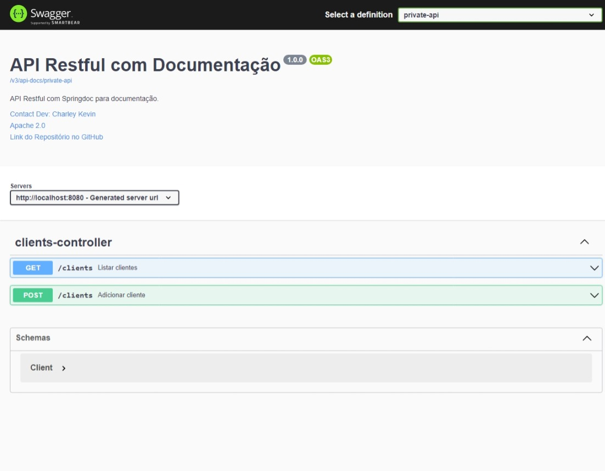

# API Java com Spring Boot e Springdoc

Este é um projeto de exemplo que demonstra uma API Java simples para cadastro e listagem de clientes. O projeto utiliza o framework Spring Boot para criar uma API REST funcional e integra o Springdoc para geração de documentação Swagger.

## Pré-requisitos

- [Java Development Kit (JDK) 17](https://www.oracle.com/java/technologies/javase-downloads.html)
- [Maven](https://maven.apache.org/download.cgi)
- [Docker](https://www.docker.com/)
- Um ambiente de desenvolvimento Java (por exemplo, Eclipse, IntelliJ IDEA, Visual Studio Code, etc.)

## Configuração

Clone o repositório:

```bash
git clone https://github.com/CharleyKevin/api-java-springdoc.git
```

Suba o conteiner:

```bash
docker-compose up
```

Acesse http://localhost:8080/swagger-ui/index.html e confira a documentação dos endpoints da api

## Screenshots da api


